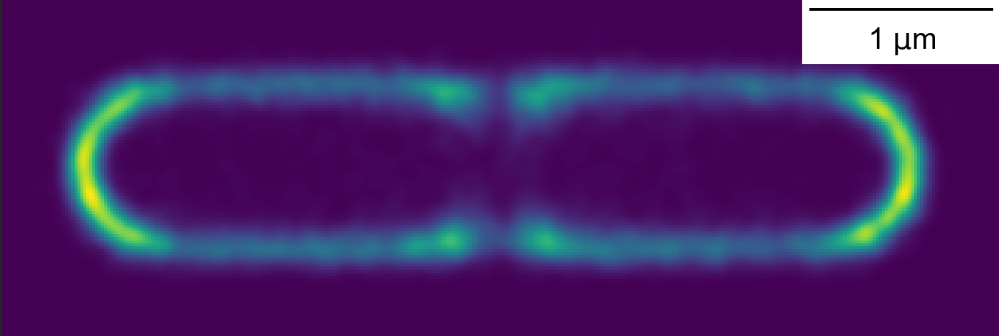

# T3SS-paper

**Code for processing of live-cell microscopy data in Yuan 2021 type III paper**: 
Yuan, B.; Portaliou, A. G.; Parakra, R.; Smit, J. H.; Wald, J.; Li, Y.; Srinivasu, B.; Loos, M. S.; Dhupar, H. 
S.; Fahrenkamp, D.; Kalodimos, C. G.; Duong van Hoa, F.; Cordes, T.; Karamanou, S.; Marlovits, T. C.; Economou, A. 
[Structural Dynamics of the Functional Nonameric Type III Translocase Export Gate. ](https://doi.org/10.1016/j.jmb.2021.167188)
Journal of Molecular Biology 2021, 433 (21), 167188.


Data is available on Zenodo: https://doi.org/10.5281/zenodo.5680700

The final dataset contains 14209 c41 cells and 10770 EPEC cells. This is a result of segmentation and 
filtering individual cells starting from 38GB of raw data.

The code in this repository reproduces supplementary figures S2 D,E.

This is a copy from my working directory and isn't the cleanest and probably will not directly run out of the box. Some 
paths need to be adjusted, neural network weights are missing, probably some code cells are redundant/erroneous. Please drop me an
email/DM if you have any questions!

To recreate the conda environment used (on Windows 10):

```console
$ conda env create -f environment.yml
```

### Contents

In the `src_data` directory are jupyter notebooks which take the raw data and apply (pre)processing. To run, 
the `data_dir` input directory should be set to the correct raw data input directory (Extract zip from Zenodo) 

01_preprocessing.ipynb: Apply darkfield/brighfield and beam profile corrections

02_segmentation.ipynb: Segment brightfield images with U-net Neural Network

03_cell_objects.ipynb: Make ColiCoords cell objects from brightfield images

04_optimization_and_selection.ipynb: This notebook is used to check the output and optimize cell coordinates.
However, optimization output here is not used but repeated later.

05_number_of_peaks.ipynb: Detect fluorescence peaks/blobs in cells and add as 'storm' dataset. This analysis 
is also repeated later

In the `src` directory are 5 more jupyter notebooks which aggregate all the data, repeat peak finding, filter
peaks, optimize cells coordinate system and produce final output graphs.

On Zenodo, the colicoords cell objects of the final step are included ('data/brightfield_opt folder). Other
intermediate steps can be reproduced by following the pipeline starting from the raw data.


*Aggregated image with localizations of 16396 T3SS foci in 10770 EPEC cells*
